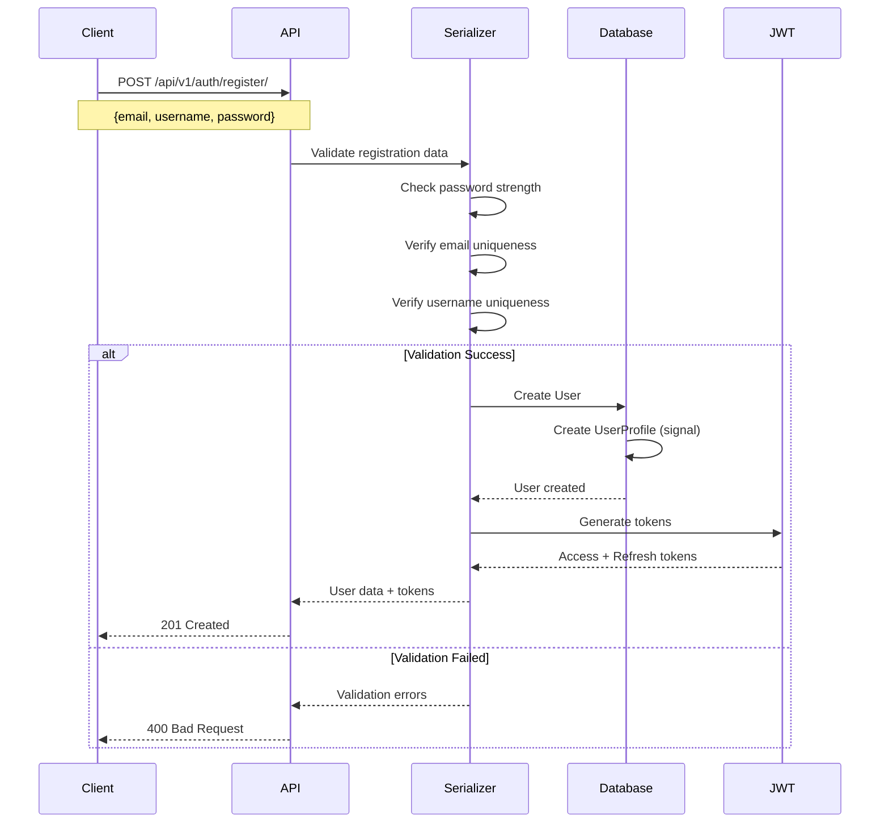
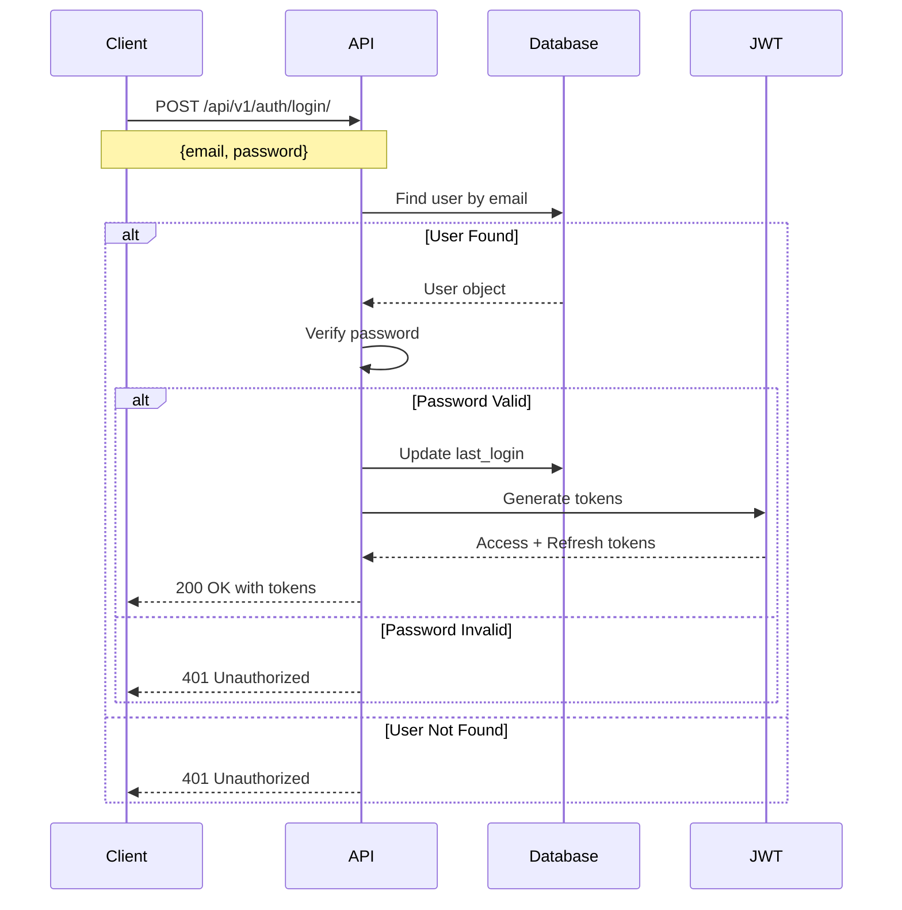
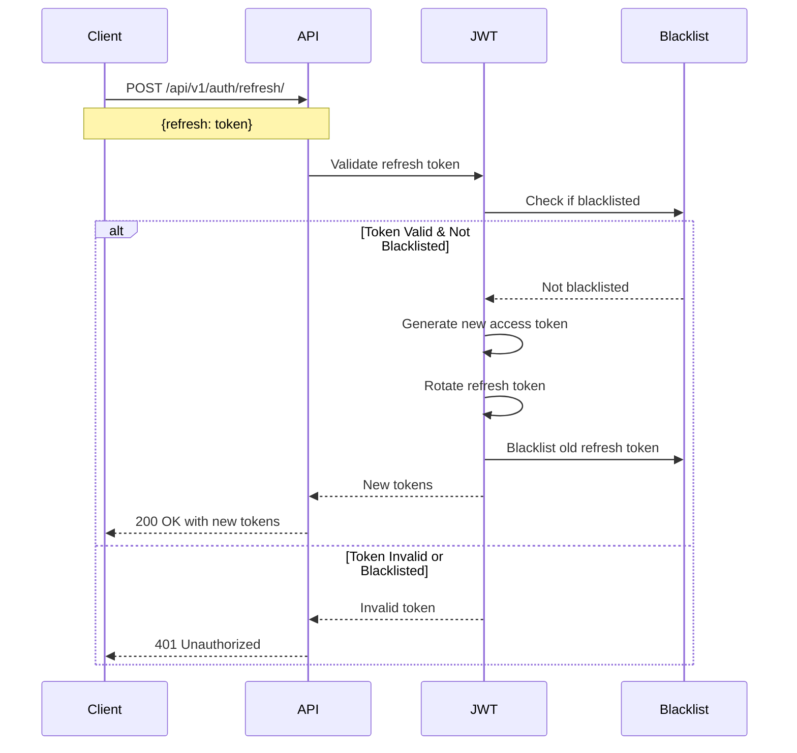
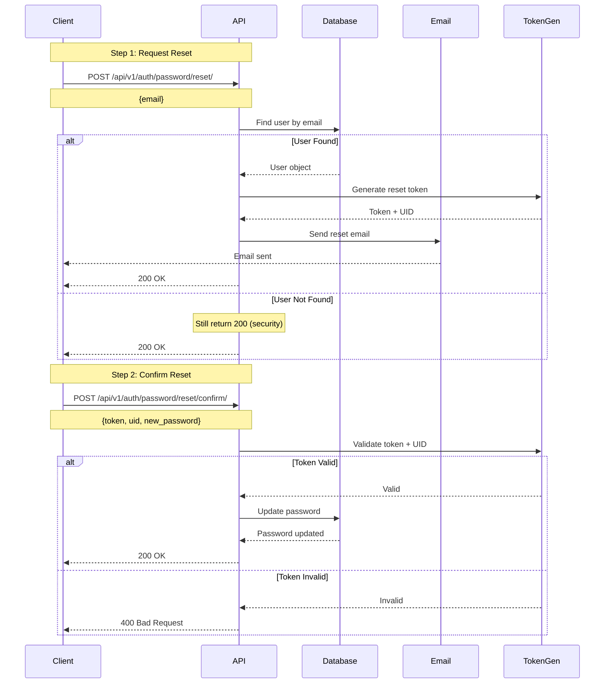
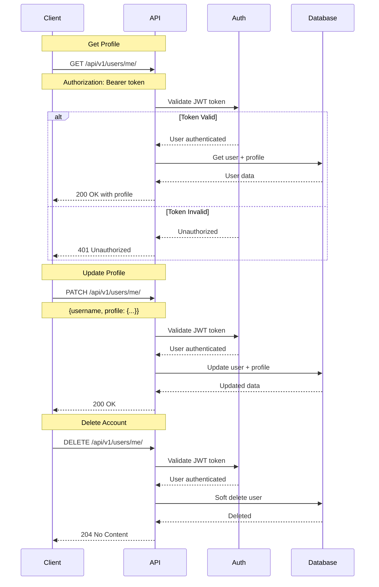
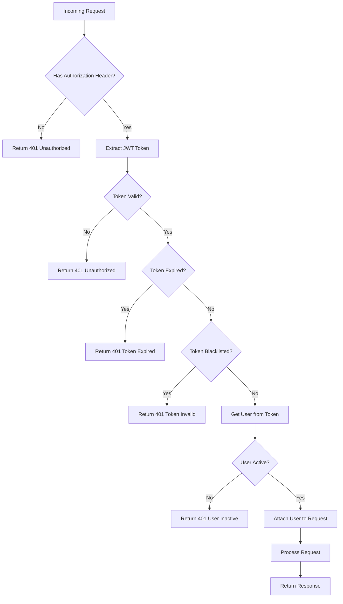
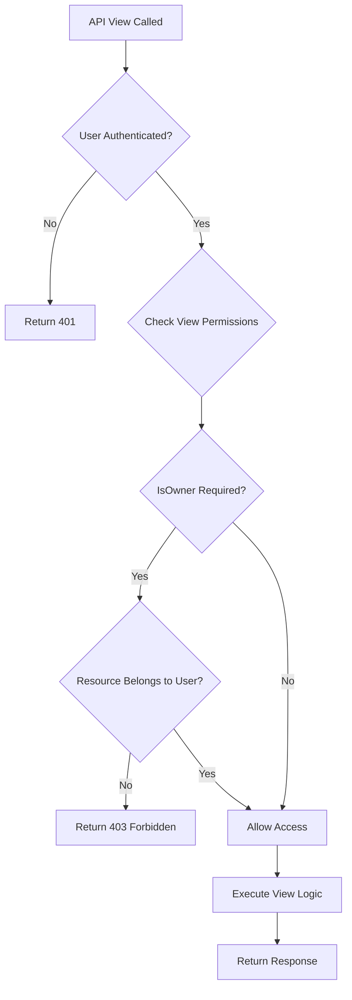
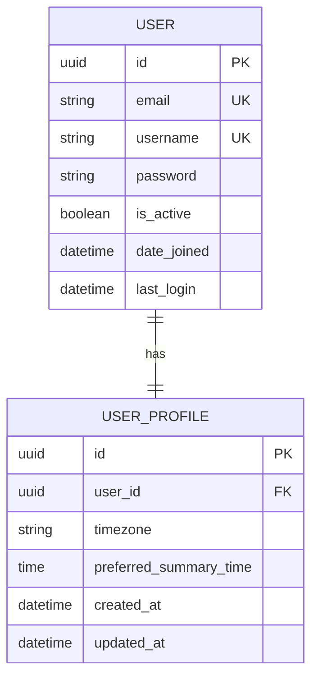
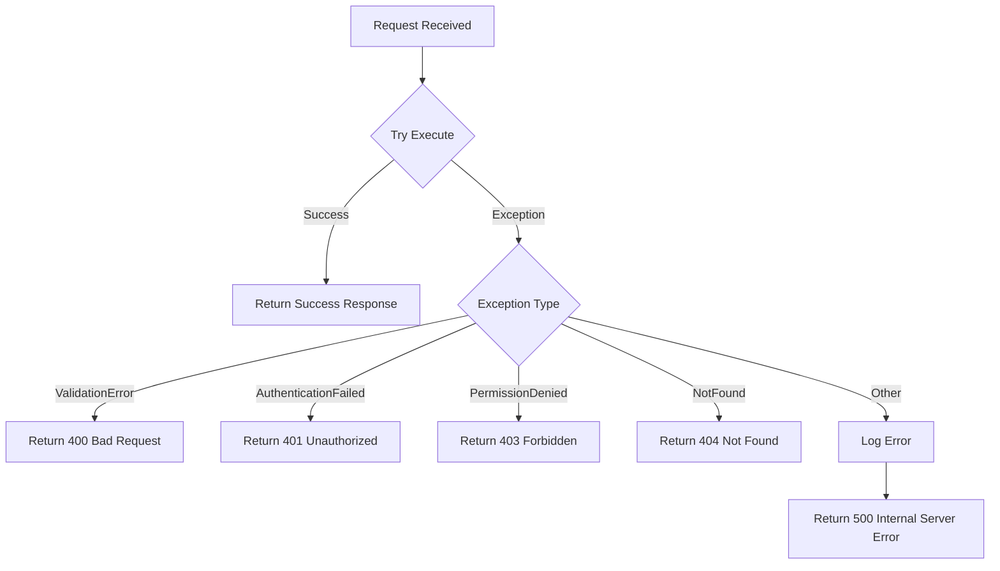
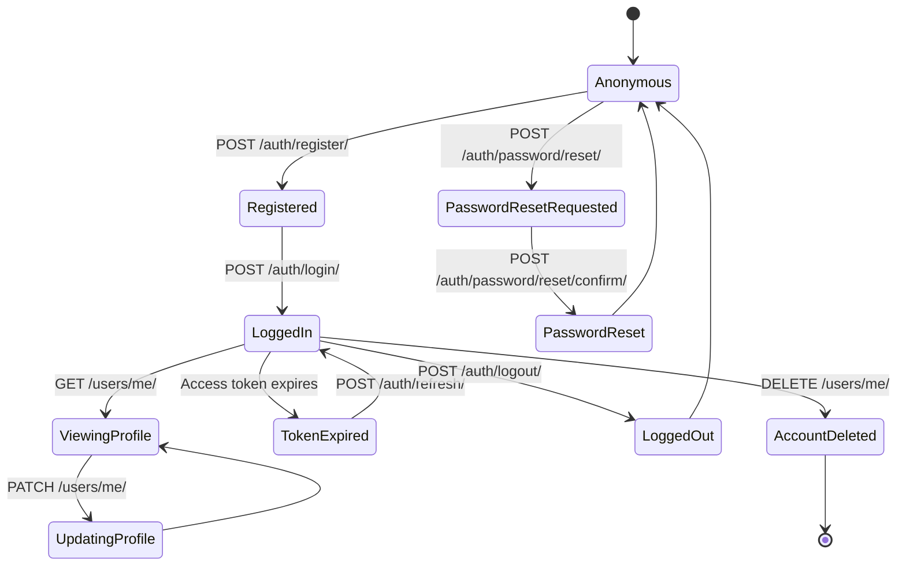

# 🔄 Account APIs Flow Diagrams

## 1. User Registration Flow

## 2. User Login Flow

## 3. Token Refresh Flow

## 4. Password Reset Flow

## 5. Profile Management Flow

## 6. Authentication Middleware Flow

## 7. Permission Check Flow

## 8. Database Schema Relationships

## 9. Error Handling Flow

## 10. Complete User Journey

## Key Implementation Notes

### 1. Signal Handlers
- Automatically create UserProfile when User is created
- Send welcome email on registration
- Log authentication events

### 2. Token Management
- Access tokens stored in memory (client-side)
- Refresh tokens can be stored in httpOnly cookies
- Blacklist tokens on logout for security

### 3. Security Best Practices
- Always hash passwords using Django's built-in hasher
- Rate limit authentication endpoints
- Use HTTPS in production
- Implement CSRF protection
- Validate all user inputs

### 4. Error Messages
- Generic messages for authentication failures (security)
- Detailed validation errors for registration
- Clear messages for token expiration

### 5. Testing Scenarios
- Valid registration with all fields
- Registration with duplicate email/username
- Login with correct/incorrect credentials
- Token refresh with valid/invalid tokens
- Password reset with valid/invalid tokens
- Profile updates with valid/invalid data
- Account deletion with active sessions