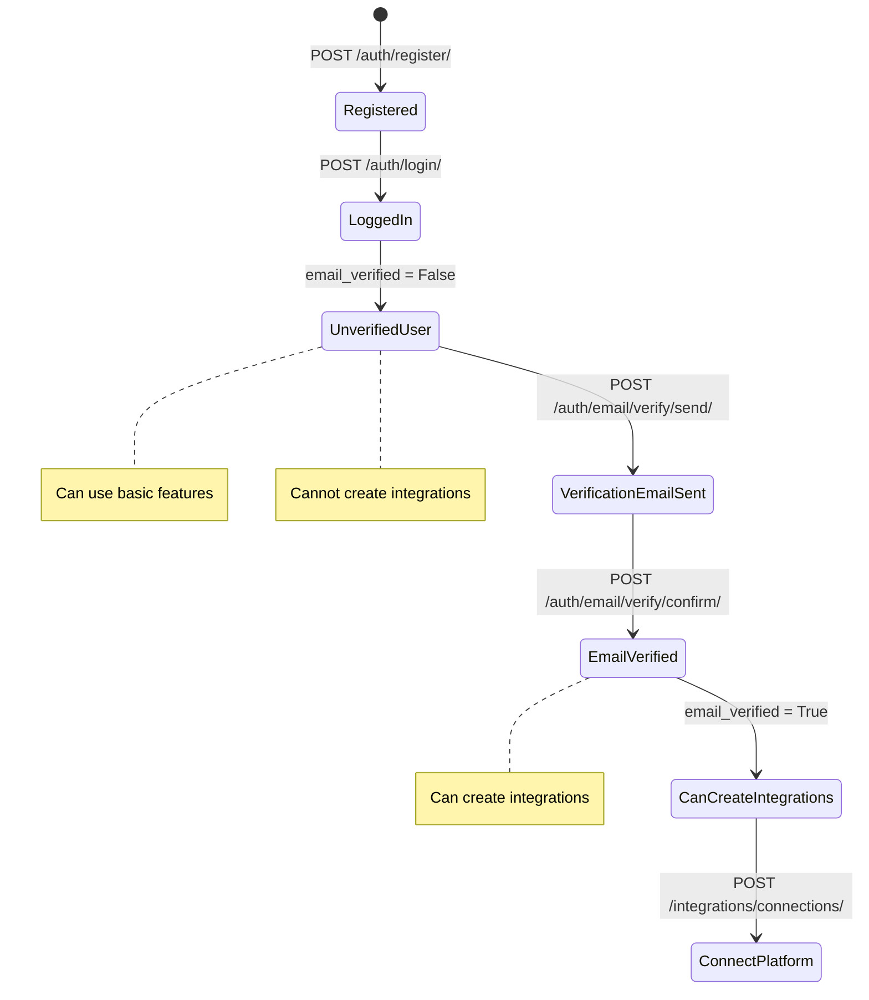

# 📋 Account APIs - Final Requirements & Specifications

## ✅ Confirmed Requirements

Based on user preferences, here are the finalized requirements for the account APIs implementation:

### 1. Authentication Method
- **JWT with Authorization Headers** (Bearer token)
- Access token lifetime: 15 minutes
- Refresh token lifetime: 7 days
- Token rotation enabled on refresh
- Blacklist old tokens after rotation

### 2. Email Service
- **SendGrid** for production email delivery
- Console backend for development/testing
- SendGrid offers a free tier: **100 emails/day** (sufficient for development and small-scale production)
- Required for password reset functionality

### 3. Email Verification Strategy
- ✅ **No verification required on signup** - Users can login immediately after registration
- ✅ **Enforce verification on first integration** - Users must verify email before connecting Discord/Telegram
- Add `email_verified` boolean field to User model (default: False)
- Create email verification endpoint: `POST /api/v1/auth/email/verify/`
- Create resend verification endpoint: `POST /api/v1/auth/email/resend/`
- Integration endpoints will check `IsEmailVerified` permission

### 4. OAuth/Social Authentication
- ❌ **Not implementing OAuth for now** - Can be added in future iterations
- Focus on email/password authentication only

## 🗄️ Updated Database Schema

### User Model (Extended)
```python
class User(AbstractUser):
    id = models.UUIDField(primary_key=True, default=uuid.uuid4, editable=False)
    email = models.EmailField(unique=True)
    username = models.CharField(max_length=150, unique=True)
    email_verified = models.BooleanField(default=False)  # NEW FIELD
    email_verified_at = models.DateTimeField(null=True, blank=True)  # NEW FIELD
    
    USERNAME_FIELD = 'email'
    REQUIRED_FIELDS = ['username']
```

## 🔌 Updated API Endpoints

### New Email Verification Endpoints

#### 1. Send Verification Email
```
POST /api/v1/auth/email/verify/send/
```
**Headers:** `Authorization: Bearer <access-token>`

**Response (200 OK):**
```json
{
  "status": "success",
  "message": "Verification email sent to user@example.com"
}
```

#### 2. Verify Email with Token
```
POST /api/v1/auth/email/verify/confirm/
```
**Request Body:**
```json
{
  "token": "verification-token-here",
  "uid": "user-id-base64"
}
```

**Response (200 OK):**
```json
{
  "status": "success",
  "message": "Email verified successfully",
  "data": {
    "email_verified": true,
    "email_verified_at": "2026-05-02T11:30:00Z"
  }
}
```

#### 3. Check Verification Status
```
GET /api/v1/auth/email/status/
```
**Headers:** `Authorization: Bearer <access-token>`

**Response (200 OK):**
```json
{
  "status": "success",
  "data": {
    "email": "user@example.com",
    "email_verified": false,
    "can_create_integrations": false
  }
}
```

## 🛡️ Custom Permissions

### IsEmailVerified Permission
```python
class IsEmailVerified(permissions.BasePermission):
    """
    Permission to check if user has verified their email.
    Used for integration-related endpoints.
    """
    message = "Email verification required. Please verify your email before connecting platforms."
    
    def has_permission(self, request, view):
        return request.user.email_verified
```

### Usage in Integration Views
```python
class PlatformConnectionViewSet(viewsets.ModelViewSet):
    permission_classes = [IsAuthenticated, IsEmailVerified]
    # Users must verify email before creating platform connections
```

## 📦 Required Dependencies

### Updated requirements.txt
```txt
# Existing
asgiref==3.11.1
Django==6.0.4
djangorestframework==3.17.1
sqlparse==0.5.5

# New Dependencies
djangorestframework-simplejwt==5.3.1
django-cors-headers==4.3.1
sendgrid==6.11.0
python-decouple==3.8  # For environment variables
```

## 🌍 Environment Variables

### .env Configuration
```bash
# Django Settings
SECRET_KEY=your-secret-key-here
DEBUG=True
ALLOWED_HOSTS=localhost,127.0.0.1

# Database (SQLite for development)
DATABASE_URL=sqlite:///db.sqlite3

# SendGrid Configuration
SENDGRID_API_KEY=your-sendgrid-api-key-here
DEFAULT_FROM_EMAIL=noreply@chatsift.com
SENDGRID_SANDBOX_MODE=False

# Frontend URL (for email links)
FRONTEND_URL=http://localhost:3000

# JWT Settings
JWT_ACCESS_TOKEN_LIFETIME=15  # minutes
JWT_REFRESH_TOKEN_LIFETIME=10080  # 7 days in minutes

# CORS Settings
CORS_ALLOWED_ORIGINS=http://localhost:3000,http://127.0.0.1:3000
```

## 📧 Email Templates

### 1. Email Verification Email
**Subject:** Verify your ChatSift email address

**Body:**
```
Hi {username},

Welcome to ChatSift! Please verify your email address to start connecting your messaging platforms.

Click the link below to verify your email:
{verification_link}

This link will expire in 24 hours.

If you didn't create this account, please ignore this email.

Best regards,
The ChatSift Team
```

### 2. Password Reset Email
**Subject:** Reset your ChatSift password

**Body:**
```
Hi {username},

We received a request to reset your password. Click the link below to create a new password:

{reset_link}

This link will expire in 1 hour.

If you didn't request this, please ignore this email.

Best regards,
The ChatSift Team
```

### 3. Welcome Email (After Verification)
**Subject:** Welcome to ChatSift!

**Body:**
```
Hi {username},

Your email has been verified! You can now:
- Connect Discord servers
- Connect Telegram groups
- Set up monitoring schedules
- Receive AI-powered summaries

Get started: {dashboard_link}

Best regards,
The ChatSift Team
```

## 🔄 User Journey with Email Verification



## 🧪 Testing Scenarios

### Email Verification Tests
1. ✅ User registers and receives verification email
2. ✅ User clicks verification link and email is verified
3. ✅ Expired verification token returns error
4. ✅ Invalid verification token returns error
5. ✅ User can resend verification email
6. ✅ Unverified user cannot create platform connections
7. ✅ Verified user can create platform connections
8. ✅ Verification status endpoint returns correct data

### SendGrid Integration Tests
1. ✅ SendGrid API key validation
2. ✅ Email sending in sandbox mode (development)
3. ✅ Email sending in production mode
4. ✅ Fallback to console backend if SendGrid fails
5. ✅ Email template rendering with user data

## 📊 Implementation Priority

### Phase 1: Core Authentication (High Priority)
1. User model with email_verified field
2. Registration endpoint (no verification required)
3. Login endpoint
4. Token refresh endpoint
5. Logout endpoint
6. Profile CRUD endpoints

### Phase 2: Email Verification (High Priority)
1. Email verification token generation
2. Send verification email endpoint
3. Verify email endpoint
4. Resend verification email endpoint
5. IsEmailVerified permission class
6. SendGrid configuration

### Phase 3: Password Reset (Medium Priority)
1. Request password reset endpoint
2. Confirm password reset endpoint
3. Password reset email template

### Phase 4: Testing & Documentation (Medium Priority)
1. Unit tests for all endpoints
2. Integration tests for email flow
3. API documentation
4. Postman collection

## 🚀 SendGrid Setup Guide

### Free Tier Details
- **100 emails/day** forever free
- No credit card required for signup
- Perfect for development and small-scale production
- Can upgrade to paid plans as needed

### Setup Steps
1. Sign up at https://sendgrid.com/
2. Verify your sender email address
3. Generate API key with "Mail Send" permissions
4. Add API key to `.env` file
5. Configure Django settings to use SendGrid

### Django SendGrid Configuration
```python
# settings.py
import os
from decouple import config

EMAIL_BACKEND = 'sendgrid_backend.SendgridBackend'
SENDGRID_API_KEY = config('SENDGRID_API_KEY')
DEFAULT_FROM_EMAIL = config('DEFAULT_FROM_EMAIL', default='noreply@chatsift.com')
SENDGRID_SANDBOX_MODE_IN_DEBUG = True  # Use sandbox in development
```

## 🔐 Security Considerations

### Email Verification Tokens
- Use Django's `default_token_generator` for verification tokens
- Tokens expire after 24 hours
- Tokens are single-use only
- Include user ID in token to prevent token reuse

### Rate Limiting
- Verification email: 3 per hour per user
- Password reset: 3 per hour per email
- Login attempts: 5 per 15 minutes per IP

### Email Security
- Use HTTPS for all verification links
- Include user-specific tokens
- Log all verification attempts
- Notify users of suspicious activity

## 📝 Success Criteria

- [ ] All authentication endpoints functional
- [ ] JWT tokens working correctly
- [ ] Email verification flow complete
- [ ] SendGrid integration working
- [ ] IsEmailVerified permission enforced on integrations
- [ ] Password reset with SendGrid emails
- [ ] 80%+ test coverage
- [ ] API documentation complete
- [ ] No security vulnerabilities

---

**Updated Timeline:** 3-4 days (added email verification)
**Priority:** High (Foundation for all features)
**Dependencies:** None (First module to implement)