# 🔄 Monitoring API - Flow Diagrams

## 📊 System Architecture

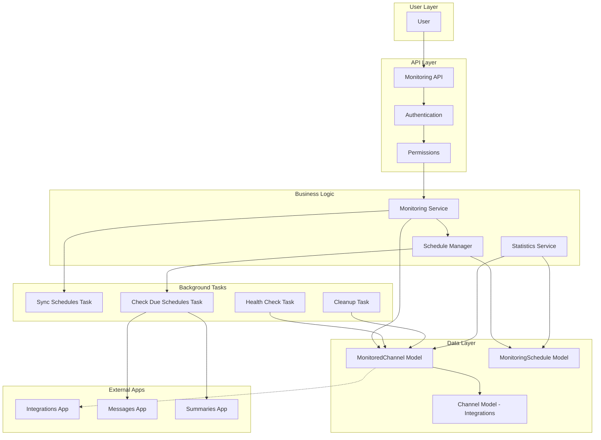

---

## 🎯 Core Workflows

### 1. Add Channel to Monitoring Flow

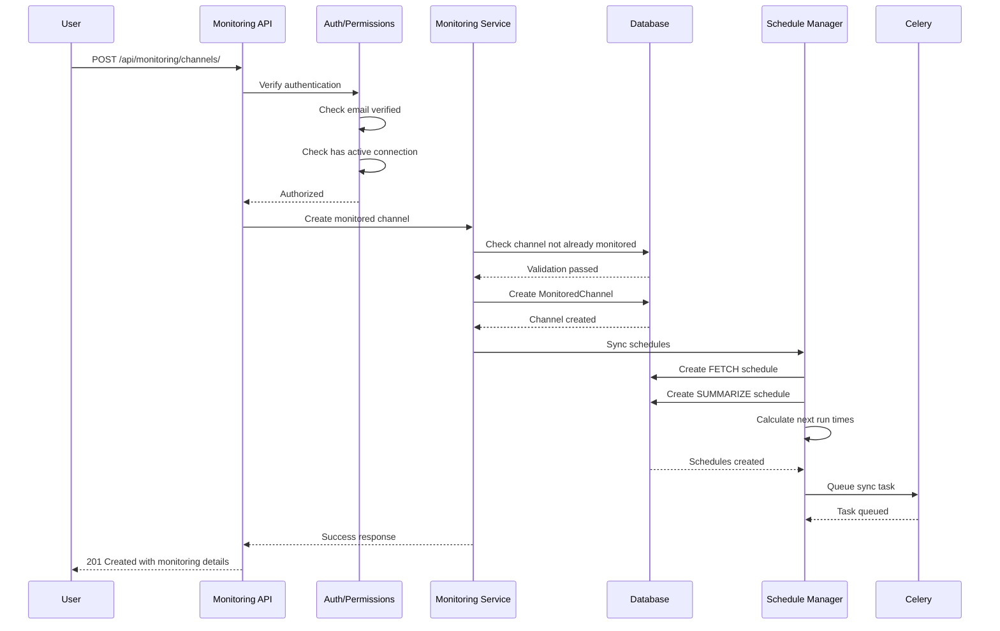

---

### 2. Update Fetch Frequency Flow

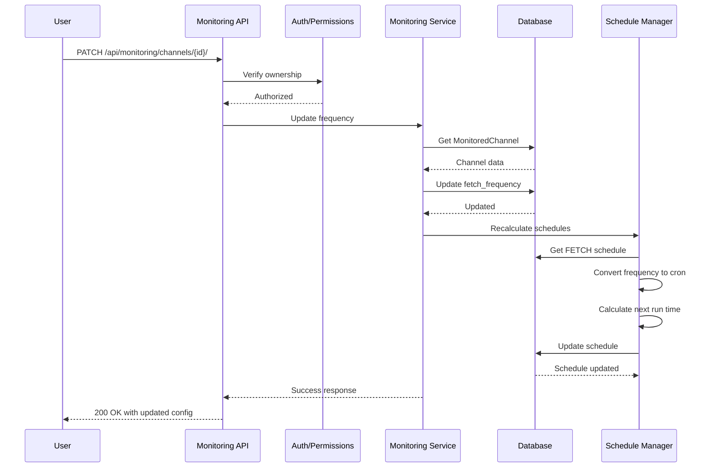

---

### 3. Schedule Execution Flow

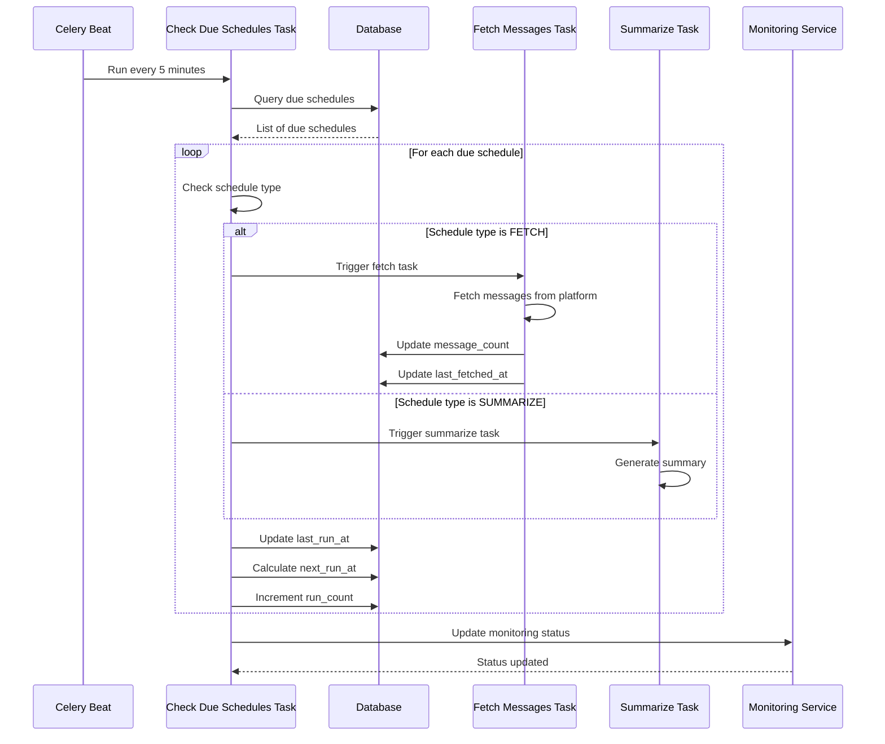

---

### 4. Health Check Flow

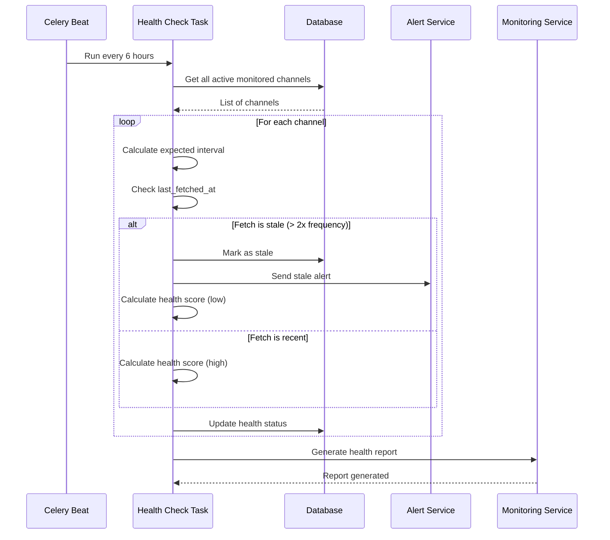

---

## 🔄 State Transitions

### MonitoredChannel States

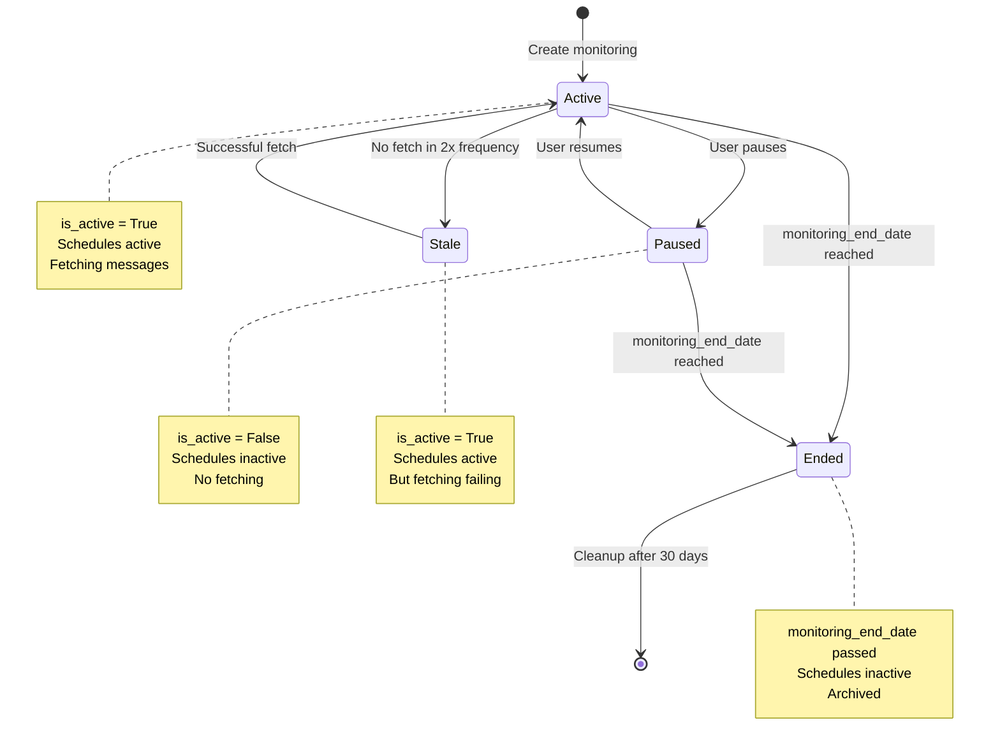

---

### MonitoringSchedule States

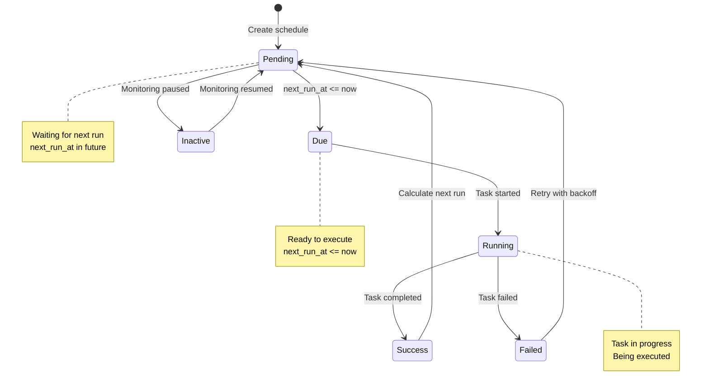

---

## 📋 Data Flow Diagrams

### 1. Monitoring Creation Data Flow

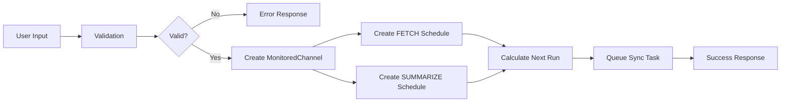

---

### 2. Schedule Execution Data Flow

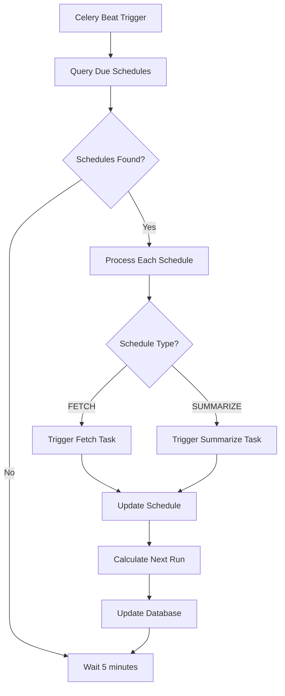

---

### 3. Health Check Data Flow

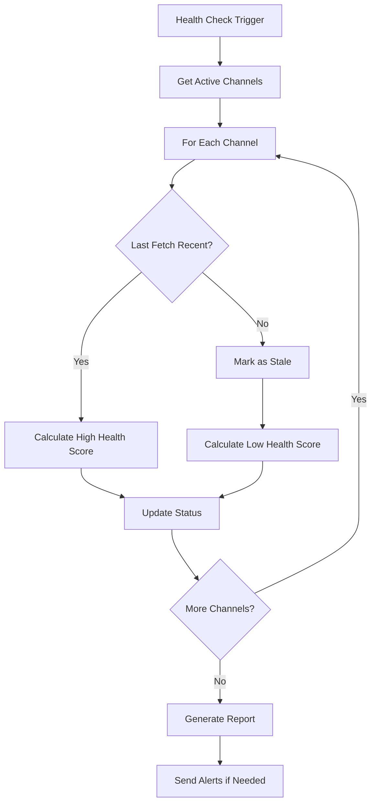

---

## 🔗 Integration Points

### With Integrations App

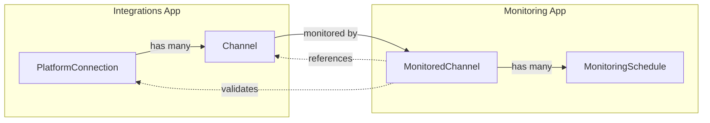

**Integration Flow:**
1. User connects platform (Integrations App)
2. Channels are discovered and stored (Integrations App)
3. User selects channels to monitor (Monitoring App)
4. Monitoring validates channel belongs to user's connection
5. Monitoring creates schedules for selected channels

---

### With Messages App (Future)

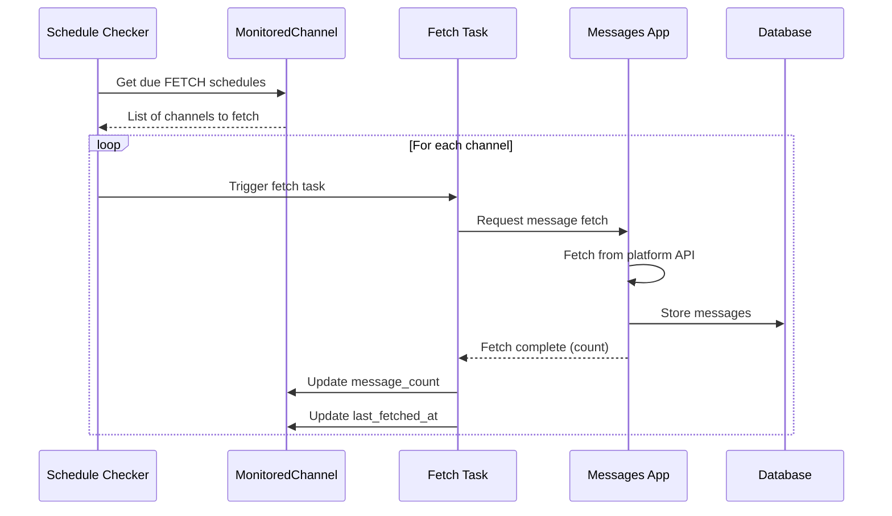

---

### With Summaries App (Future)

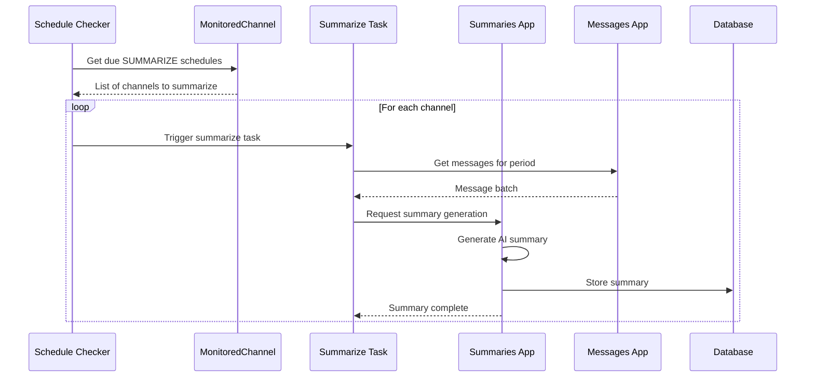

---

## 🎯 User Journey Flows

### Journey 1: First-Time Setup

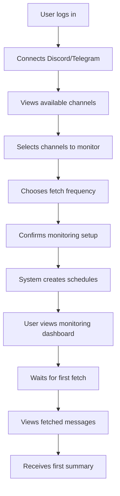

---

### Journey 2: Managing Monitoring

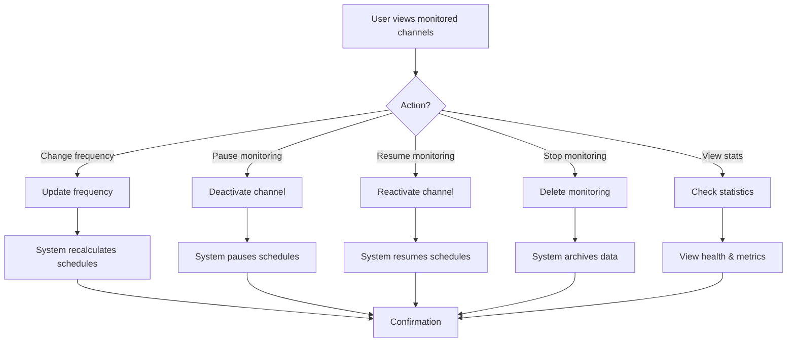

---

### Journey 3: Troubleshooting

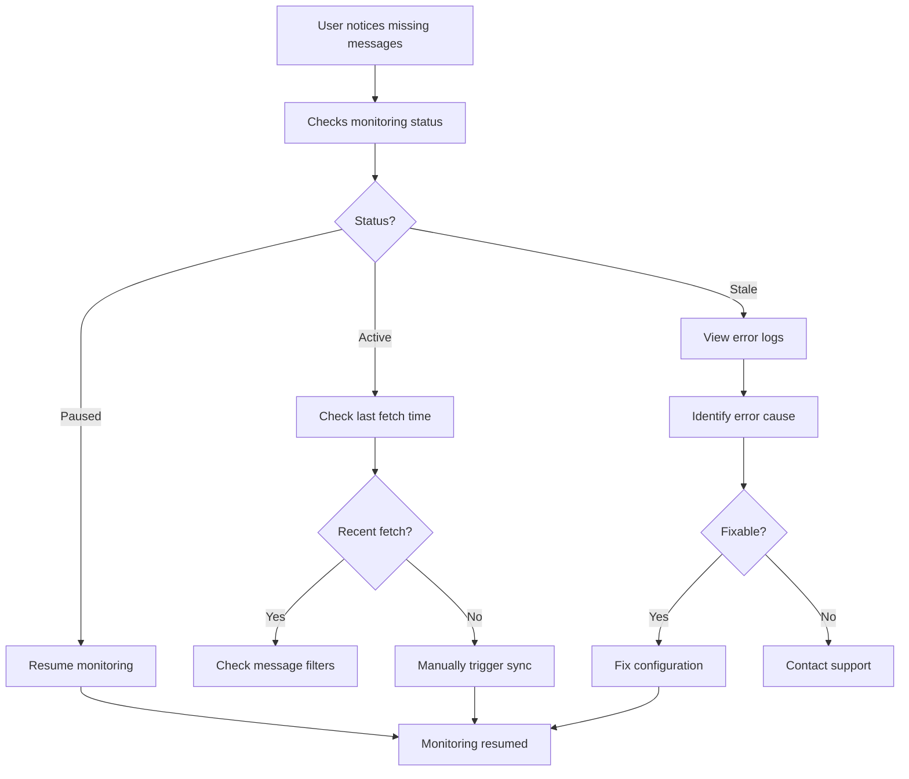

---

## 🔄 Background Task Scheduling

### Celery Beat Schedule

```mermaid
gantt
    title Monitoring Background Tasks Schedule
    dateFormat HH:mm
    axisFormat %H:%M
    
    section Every 5 Minutes
    Check Due Schedules :active, 00:00, 5m
    Check Due Schedules :active, 00:05, 5m
    Check Due Schedules :active, 00:10, 5m
    
    section Every 6 Hours
    Health Check :crit, 00:00, 30m
    Health Check :crit, 06:00, 30m
    Health Check :crit, 12:00, 30m
    Health Check :crit, 18:00, 30m
    
    section Weekly
    Cleanup Inactive :milestone, 00:00, 1h
```

---

## 📊 Performance Considerations

### Query Optimization Flow

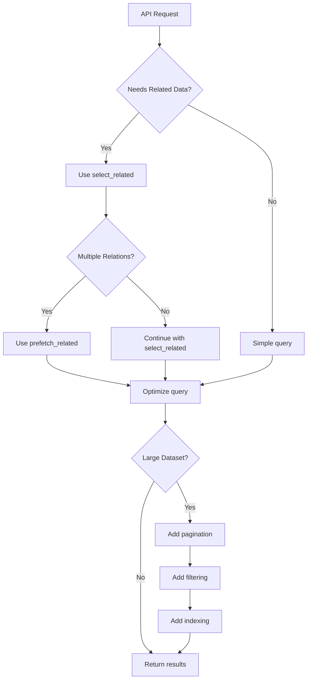

---

## 🎓 Key Takeaways

### Critical Flows to Understand
1. **Monitoring Creation:** User → API → Validation → Database → Schedule Creation
2. **Schedule Execution:** Celery Beat → Check Due → Trigger Tasks → Update Status
3. **Health Monitoring:** Periodic Check → Detect Issues → Alert → Update Status
4. **Integration:** Monitoring ← Integrations → Messages → Summaries

### Important State Transitions
- Active ↔ Paused (user control)
- Active → Stale (system detection)
- Pending → Due → Running → Success/Failed (schedule lifecycle)

### Performance Patterns
- Use select_related for ForeignKey
- Use prefetch_related for reverse ForeignKey
- Add indexes on frequently queried fields
- Implement pagination for large datasets
- Cache statistics and computed values

---

# Made with Bob

Built with ❤️ by Bob, your AI coding assistant.